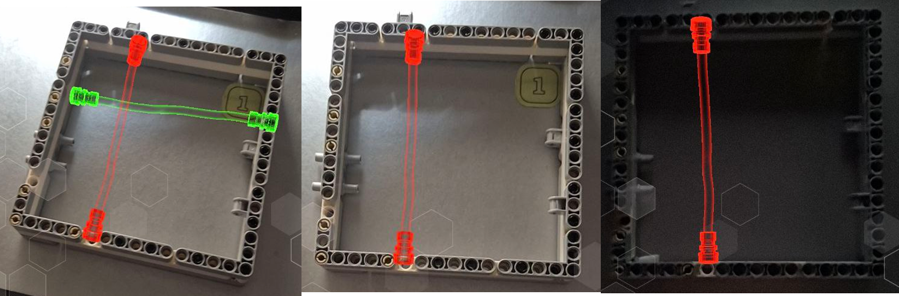
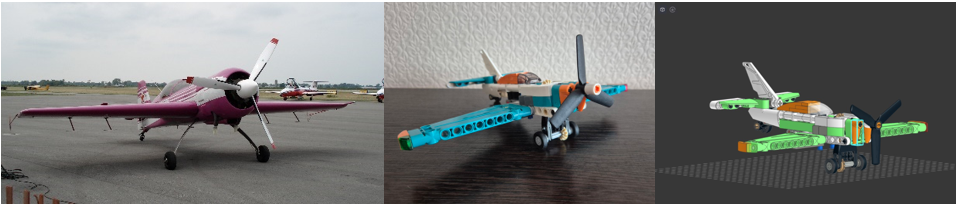
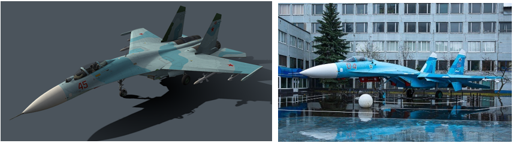
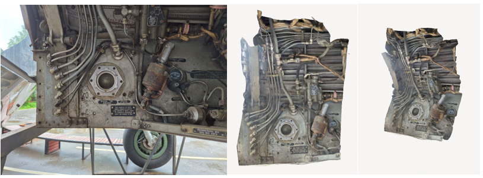

# AirServiceARApp - AR Assistant for Technical Specialists

An assistant for performing strictly regulated procedures on aircraft.

- **Platforms Supported**: Android / UWP (Universal Windows Platform)
- **Orientation**: Portrait / Landscape

## Project Repository on Google Drive
[Google Drive Repository](https://drive.google.com/drive/folders/1kZfo8nbCVH4TsjvQ5zomu5GOjeuyxBzS?usp=sharing)

## Concept:
The project is an AR-based assistant application designed to assist in technical and service operations on aircraft. This application is intended for both experienced technical specialists and beginners. The application uses an adaptive object tracking method (AR tracking) that combines two methods: marker-based and 3D-model-based tracking.

The application supports two scenarios:
1. Installation of electrical equipment and power supply system components on the aircraft.
2. Pre-flight external inspection of the aircraft.

### User Interface:

*Figure 1 - User Interface*

## Lifecycle:
1. Launch the application by pressing the "Log In" button on the start screen.
2. A screen with an application description and scenarios, as well as two buttons to navigate to the desired scenario.
3.1 A screen with safety information during electrical installation work on the aircraft's power supply system.
3.2 A screen projecting the location of electrical cables for installation with attachment points. Exit the scenario via the red button.
4.1 A screen with safety information for the pre-flight external inspection of the aircraft.
4.2 A screen projecting key inspection points and using the "CHECK LIST." Exit the scenario via the red button.

## Research:

*Figure 2 - Research on Tracking Methods Integrated in Vuforia*

[Research Files](https://drive.google.com/drive/folders/1UVVS9vRTMQKNrEVhYAgVnCg8e3xSWScA?usp=sharing)

## Builds:
The project build for the Su-26 prototype aircraft can be downloaded from the following link:

*Figure 3 - Su-26 and its prototype*

[Su-26 Build](https://drive.google.com/drive/folders/1C7WJ4_kerAqSUeQjwr-tpGG2lwf7-KaO?usp=sharing)

## Demo Video:
[Demo Video Link](https://drive.google.com/drive/folders/1jCs8cl1X0sPeTrEUX30L7zbeGoPQQ0Il?usp=sharing)

The build for the Su-27 aircraft and the landing gear compartment:

[Su-27 and Landing Gear Compartment Build](https://drive.google.com/drive/folders/1hOKxP3gP5wTQn3r-2z7Y3jbQn9inQ0PC?usp=sharing)

### Demo Video (Su-27):

*Figure 4 - Su-27 and its 3D Model*

[Su-27 Demo Video](https://drive.google.com/drive/folders/1curRWBEl01Ym4-pfPgkoKCoC_ypIg4Gq?usp=sharing)

### Demo Video (MiG-29 Landing Gear Compartment):

*Figure 5 - MiG-29 Landing Gear Compartment*

[MiG-29 Demo Video](https://drive.google.com/drive/folders/17UptBTywJ9kXrzgA1fpMs9hqpBGRts9v?usp=sharing)

## Build for the Improvised Aircraft Compartment for HoloLens 2:

*Figure 6 - Scene with Improvised Aircraft Compartment*

[HoloLens 2 Build](https://drive.google.com/drive/folders/1u0q4tF7p8mqf6p2T5dF0YxOjM_k43Ta9?usp=sharing)

## Developer of the AR Project:
1. Maxim Peshkov (M8O-209M-23)

